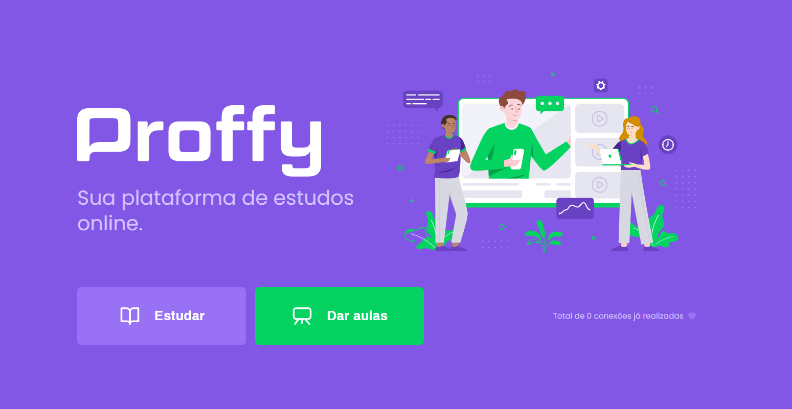

<h4 align="center">

</h4>

    
	
    

# About 🧾

Esse projeto vou desenvolvido durante a segunda edição da Next Level Week.
Basicamente, o **Proffy** é um projeto que tem o objetivo de conectar pessoas, alunos e professores, que possuam interesse em aprender e/ou ensinar. 
Semelhante a NLW#1, o projeto foi dividido em **três seções**, a **primeira** consiste na aplicação web. A **segunda** seção representa a aplicação mobile. Já a **terceira** é constituída pela API, que possibilita o contato com o banco de dados, para armazenar e consultar informações.

# Tecnologias utilizadas 🧰
- [**Node.js**](https://nodejs.org/en/)
- [**Expo**](https://expo.io/)
- [**Express**](https://expressjs.com/pt-br/)
- [**React**](https://pt-br.reactjs.org/) 
- [**React Native**](https://reactnative.dev/) 
- [**TypeScript**](https://www.typescriptlang.org/)
# Principais libs 📚
  - [**Express**](https://expressjs.com/pt-br/)
  - [**KnexJS**](http://knexjs.org/)
  - [**SQLite3**](https://www.sqlite.org/index.html)
  - [**Axios**](https://github.com/axios/axios)
  - [**Leaflet**](https://leafletjs.com/)
  - [**Expo Google Fonts**](https://github.com/expo/google-fonts)
  - [**Picker Select**](https://github.com/lawnstarter/react-native-picker-select)
  - [**Multer**](https://github.com/expressjs/multer)
  - [**Celebrate**](https://github.com/arb/celebrate)

<h4 align="center">

</h4>